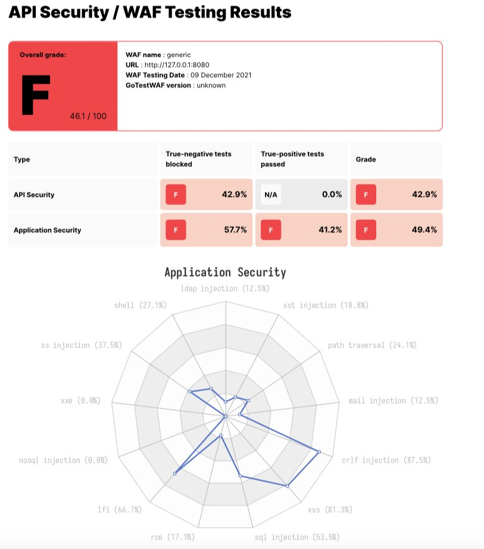

# GoTestWAF

GoTestWAF is a tool for API and OWASP attack simulation that supports a wide range of API protocols including
REST, GraphQL, gRPC, WebSockets, SOAP, XMLRPC, and others.

It was designed to evaluate web application security solutions, such as API security proxies, Web Application Firewalls,
IPS, API gateways, and others.

---
* [How it works](https://github.com/wallarm/gotestwaf#how-it-works)
* [Requirements](https://github.com/wallarm/gotestwaf#requirements)
* [Quick start with Docker](https://github.com/wallarm/gotestwaf#quick-start-with-docker)
* [Checking evaluation results](https://github.com/wallarm/gotestwaf#checking-the-evaluation-results)
* [Demos](https://github.com/wallarm/gotestwaf#demos)
* [Other options to run GoTestWAF](https://github.com/wallarm/gotestwaf#other-options-to-run-gotestwaf)
* [Configuration options](https://github.com/wallarm/gotestwaf#configuration-options)
---

## How it works

GoTestWAF generates malicious requests using encoded payloads placed in different parts of HTTP requests: its body, headers,
URL parameters, etc. Generated requests are sent to the application security solution URL specified during GoTestWAF launch.
The results of the security solution evaluation are recorded in the report file created on your machine.

Default conditions for request generation are defined in the `testcases` folder in the YAML files of the following format:

```yaml
---
payload:
  - '"union select -7431.1, name, @aaa from u_base--w-'
  - "'or 123.22=123.22"
  - "' waitfor delay '00:00:10'--"
  - "')) or pg_sleep(5)--"
encoder:
  - Base64Flat
  - URL
placeholder:
  - UrlPath
  - UrlParam
  - JSUnicode
  - Header
...
```

* `payload` is a malicious attack sample (e.g XSS payload like ```<script>alert(111)</script>``` or something more sophisticated).
Since the format of the YAML string is required for payloads, they must be [encoded as binary data](https://yaml.org/type/binary.html).
* `encoder` is an encoder to be applied to the payload before placing it to the HTTP request. Possible encoders are:

    * Base64
    * Base64Flat
    * JSUnicode
    * URL
    * Plain (to keep the payload string as-is)
    * XML Entity
* `placeholder` is a place inside HTTP request where encoded payload should be. Possible placeholders are:

    * Header
    * RequestBody
    * JSONRequest
    * JSONBody
    * HTMLForm
    * HTMLMultipartForm
    * SOAPBody
    * XMLBody
    * URLParam
    * URLPath

Request generation is a three-step process involving the multiplication of payload amount by encoder and placeholder amounts.
Let's say you defined 2 **payloads**, 3 **encoders** (Base64, JSUnicode, and URL) and 1 **placeholder** (URLParameter - HTTP GET parameter).
In this case, GoTestWAF will send 2x3x1 = 6 requests in a test case.

During GoTestWAF launch, you can also choose test cases between two embedded: OWASP Top-10, OWASP-API,
or your own (by using the [configuration option](https://github.com/wallarm/gotestwaf#configuration-options) `testCasePath`).

## Requirements

* GoTestwaf supports all the popular operating systems (Linux, Windows, macOS), and can be built natively
if [Go](https://golang.org/doc/install) is installed in the system.
* If running GoTestWAF as the Docker container, please ensure you have [installed and configured Docker](https://docs.docker.com/get-docker/),
and GoTestWAF and evaluated application security solution are connected to the same [Docker network](https://docs.docker.com/network/).
* For GoTestWAF to be successfully started, please ensure the IP address of the machine running GoTestWAF is whitelisted
on the machine running the application security solution.

## Quick start with Docker

The steps below walk through downloading and starting GoTestWAF with minimal configuration on Docker.

1. Pull the [GoTestWAF image](https://hub.docker.com/r/wallarm/gotestwaf) from Docker Hub:

    ```
    docker pull wallarm/gotestwaf
    ```
2. Start the GoTestWAF image:

    ```
    docker run -v ${PWD}/reports:/app/reports --network="host" \
        wallarm/gotestwaf --url=<EVALUATED_SECURITY_SOLUTION_URL>
    ```

    If required, you can replace `${PWD}/reports` with the path to another folder used to place the evaluation report.

    If the evaluated security tool is available externally, you can skip the option `--network="host"`. This option enables interaction of Docker containers running on 127.0.0.1.
3. Find the report file `waf-evaluation-report-<date>.pdf` in the `reports` folder that you mapped to `/app/reports`
inside the container.

You have successfully evaluated your application security solution by using GoTestWAF with minimal configuration.
To learn advanced configuration options, please use this [link](https://github.com/wallarm/gotestwaf#configuration-options).

## Checking the evaluation results

Check the evaluation results logged using the `STDOUT` and `STDERR` services. For example:

```
GOTESTWAF : 2021/10/07 16:06:38.401836 main.go:67: Test cases loading started
GOTESTWAF : 2021/10/07 16:06:38.403985 main.go:74: Test cases loading finished
GOTESTWAF : 2021/10/07 16:06:38.404007 main.go:87: gRPC pre-check: IN PROGRESS
GOTESTWAF : 2021/10/07 16:06:41.404701 main.go:91: gRPC pre-check: connection is not available, reason: sending gRPC request: context deadline exceeded
GOTESTWAF : 2021/10/07 16:06:41.404759 main.go:101: Scanned URL: http://172.17.0.1:8080/
GOTESTWAF : 2021/10/07 16:06:41.415870 main.go:125: WAF pre-check: OK. Blocking status code: 403
GOTESTWAF : 2021/10/07 16:06:41.415969 main.go:140: WebSocket pre-check. URL to check: ws://172.17.0.1:8080/
GOTESTWAF : 2021/10/07 16:06:41.426661 main.go:144: WebSocket pre-check: connection is not available, reason: websocket: bad handshake
GOTESTWAF : 2021/10/07 16:06:41.427029 main.go:172: Scanning http://172.17.0.1:8080/
GOTESTWAF : 2021/10/07 16:06:41.427117 scanner.go:149: Scanning started
GOTESTWAF : 2021/10/07 16:06:44.321301 scanner.go:154: Scanning Time:  2.89414802s
GOTESTWAF : 2021/10/07 16:06:44.321342 scanner.go:185: Scanning finished

Negative Tests:
+-----------------------+-----------------------+-----------------------+-----------------------+-----------------------+-----------------------+
|       TEST SET        |       TEST CASE       |     PERCENTAGE, %     |        BLOCKED        |       BYPASSED        |      UNRESOLVED       |
+-----------------------+-----------------------+-----------------------+-----------------------+-----------------------+-----------------------+
| community             | community-lfi         |                 66.67 |                     4 |                     2 |                     0 |
| community             | community-rce         |                 14.29 |                     6 |                    36 |                     0 |
| community             | community-sqli        |                 70.83 |                    34 |                    14 |                     0 |
| community             | community-xss         |                 91.78 |                   279 |                    25 |                     0 |
| community             | community-xxe         |                  0.00 |                     0 |                     2 |                     0 |
| owasp                 | crlf                  |                 87.50 |                     7 |                     1 |                     0 |
| owasp                 | ldap-injection        |                 12.50 |                     1 |                     7 |                     0 |
| owasp                 | mail-injection        |                 25.00 |                     3 |                     9 |                     0 |
| owasp                 | nosql-injection       |                  0.00 |                     0 |                    18 |                     0 |
| owasp                 | path-traversal        |                 25.00 |                    16 |                    48 |                     2 |
| owasp                 | rce                   |                 22.22 |                     4 |                    14 |                     0 |
| owasp                 | rce-urlparam          |                 33.33 |                     1 |                     2 |                     0 |
| owasp                 | shell-injection       |                 25.00 |                     6 |                    18 |                     0 |
| owasp                 | sql-injection         |                 25.00 |                    12 |                    36 |                     0 |
| owasp                 | ss-include            |                 25.00 |                     5 |                    15 |                     0 |
| owasp                 | sst-injection         |                 15.62 |                     5 |                    27 |                     0 |
| owasp                 | xml-injection         |                  0.00 |                     0 |                    13 |                     0 |
| owasp                 | xss-scripting         |                 25.00 |                    17 |                    51 |                     0 |
| owasp-api             | graphql               |                  0.00 |                     0 |                     2 |                     0 |
| owasp-api             | graphql-post          |                 33.33 |                     1 |                     2 |                     0 |
| owasp-api             | grpc                  |                  0.00 |                     0 |                     0 |                     2 |
| owasp-api             | rest                  |                100.00 |                     2 |                     0 |                     0 |
| owasp-api             | soap                  |                100.00 |                     2 |                     0 |                     0 |
+-----------------------+-----------------------+-----------------------+-----------------------+-----------------------+-----------------------+
|         DATE:         |       WAF NAME:       |  WAF AVERAGE SCORE:   |  BLOCKED (RESOLVED):  | BYPASSED (RESOLVED):  |      UNRESOLVED:      |
|      2021-10-07       |        GENERIC        |        34.70%         |   405/747 (54.22%)    |   342/747 (45.78%)    |     4/751 (0.53%)     |
+-----------------------+-----------------------+-----------------------+-----------------------+-----------------------+-----------------------+

Positive Tests:
+-----------------------+-----------------------+-----------------------+-----------------------+-----------------------+-----------------------+
|       TEST SET        |       TEST CASE       |     PERCENTAGE, %     |        BLOCKED        |       BYPASSED        |      UNRESOLVED       |
+-----------------------+-----------------------+-----------------------+-----------------------+-----------------------+-----------------------+
| false-pos             | texts                 |                 17.65 |                    14 |                     3 |                     0 |
+-----------------------+-----------------------+-----------------------+-----------------------+-----------------------+-----------------------+
|         DATE:         |       WAF NAME:       |  WAF POSITIVE SCORE:  | FALSE POSITIVE (RES): | TRUE POSITIVE (RES):  |      UNRESOLVED:      |
|      2021-10-07       |        GENERIC        |        17.65%         |    14/17 (82.35%)     |     3/17 (17.65%)     |     0/17 (0.00%)      |
+-----------------------+-----------------------+-----------------------+-----------------------+-----------------------+-----------------------+

PDF report is ready: reports/waf-evaluation-report-generic-2021-October-07-16-06-44.pdf
```

The report file `waf-evaluation-report-<date>.pdf` is available in the `reports` folder of the user directory.



## Demos

You can try GoTestWAF by running the demo environment that deploys NGINX‑based [ModSecurity using OWASP Core Rule Set](https://hub.docker.com/r/owasp/modsecurity-crs)
and GoTestWAF evaluating ModSecurity on Docker.

To run the demo environment:

1. Clone this repository and go to the cloned directory:

    ```
    git clone https://github.com/wallarm/gotestwaf.git
    cd gotestwaf
    ```
2. Start ModSecurity from the [Docker image](https://hub.docker.com/r/owasp/modsecurity-crs/) by using the following `make` command:
    
    ```
    make modsec
    ```

    Settings for running the ModSecurity Docker container are defined in the rule `modsec` of the cloned Makefile. It runs the ModSecurity Docker container on port 8080 with minimal configuration defined in the cloned file `./resources/default.conf` and the `PARANOIA` value set to 1.

    If required, you can change these settings by editing the rule `modsec` in the cloned Makefile. Available options for ModSecurity configuration are described on [Docker Hub](https://hub.docker.com/r/owasp/modsecurity-crs/).
3. Start GoTestWAF with minimal configuration by using one of the following methods:

    Start the [Docker image](https://hub.docker.com/r/wallarm/gotestwaf) by using the following `docker pull` and `docker run` commands:

    ```
    docker pull wallarm/gotestwaf
    docker run -v ${PWD}/reports:/app/reports --network="host" \
        wallarm/gotestwaf --url=http://127.0.0.1:8080
    ```

    Build the GoTestWAF Docker image from the [Dockerfile](https://github.com/wallarm/gotestwaf/blob/master/Dockerfile) and run the
    image by using the following `make` commands (make sure ModSec is running on port 8080; if not, update the port value in the Makefile):

    ```
    make gotestwaf
    make scan_local_from_docker
    ```

    Start GoTestWAF natively with go by using the following `make` command:
    (make sure ModSec is running on port 8080; if not, update the port value in the Makefile):

    ```
    make scan_local
    ```
4. Find the [report](https://github.com/wallarm/gotestwaf#checking-the-evaluation-results) file `waf-evaluation-report-<date>.pdf` in
the `reports` folder that you mapped to `/app/reports` inside the container.

## Other options to run GoTestWAF

In addition to running the GoTestWAF Docker image downloaded from Docker Hub, you can run GoTestWAF by using the following options:

* Clone this repository and build the GoTestWAF Docker image from the [Dockerfile](https://github.com/wallarm/gotestwaf/blob/master/Dockerfile), 
for example:

    ```
    git clone https://github.com/wallarm/gotestwaf.git
    cd gotestwaf
    docker build . --force-rm -t gotestwaf
    docker run -v ${PWD}/reports:/app/reports --network="host" \
        gotestwaf --url=<EVALUATED_SECURITY_SOLUTION_URL>
    ```

    If the evaluated security tool is available externally, you can skip the option `--network="host"`. This option enables interaction of Docker containers running on 127.0.0.1.
* Clone this repository and run GoTestWAF with [`go`](https://golang.org/doc/), for example:

    ```
    git clone https://github.com/wallarm/gotestwaf.git
    cd gotestwaf
    go run ./cmd --url=<EVALUATED_SECURITY_SOLUTION_URL> --verbose
    ```
* Clone this repository and build GoTestWAF as the Go module:

    ```
    git clone https://github.com/wallarm/gotestwaf.git
    cd gotestwaf
    go build -mod vendor -o gotestwaf ./cmd/main.go
    ```

Supported GoTestWAF configuration options are described below.

## Configuration options

```
Usage of /app/gotestwaf:
      --addHeader string       An HTTP header to add to requests
      --blockConnReset         If true, connection resets will be considered as block
      --blockRegex string      Regex to detect a blocking page with the same HTTP response status code as a not blocked request
      --blockStatusCode int    HTTP status code that WAF uses while blocking requests (default 403)
      --configPath string      Path to the config file (default "config.yaml")
      --followCookies          If true, use cookies sent by the server. May work only with --maxIdleConns=1
      --idleConnTimeout int    The maximum amount of time a keep-alive connection will live (default 2)
      --ignoreUnresolved       If true, unresolved test cases will be considered as bypassed (affect score and results)
      --maxIdleConns int       The maximum number of keep-alive connections (default 2)
      --maxRedirects int       The maximum number of handling redirects (default 50)
      --nonBlockedAsPassed     If true, count requests that weren't blocked as passed. If false, requests that don't satisfy to PassStatuscode/PassRegExp as blocked
      --passRegex string       Regex to a detect normal (not blocked) web page with the same HTTP status code as a blocked request
      --passStatusCode int     HTTP response status code that WAF uses while passing requests (default 200)
      --proxy string           Proxy URL to use
      --randomDelay int        Random delay in ms in addition to the delay between requests (default 400)
      --reportPath string      A directory to store reports (default "reports")
      --sendDelay int          Delay in ms between requests (default 400)
      --skipWAFBlockCheck      If true, WAF detection tests will be skipped
      --testCase string        If set then only this test case will be run
      --testCasesPath string   Path to a folder with test cases (default "testcases")
      --testSet string         If set then only this test set's cases will be run
      --tlsVerify              If true, the received TLS certificate will be verified
      --url string             URL to check (default "http://localhost/")
      --verbose                If true, enable verbose logging (default true)
      --wafName string         Name of the WAF product (default "generic")
      --workers int            The number of workers to scan (default 200)
      --wsURL string           WebSocket URL to check
```

The listed options can be passed to GoTestWAF as follows:

* If running the GoTestWAF Docker container, pass the configuration options in the `docker run` command after the Docker image name.

    For example, to run GoTestWAF with WebSocket check, you can specify the WebSocket URL via the `wsURL` option
    and `verbose` flag to include more information about the checking process:

    ```
    docker run -v ${PWD}/reports:/app/reports --network="host" wallarm/gotestwaf \
        --url=http://127.0.0.1:8080/ --wsURL=ws://127.0.0.1:8080/api/ws --verbose
    ```

* If running GoTestWAF with `go run`, pass the configuration options and its values as the parameters for the main script.

    For example, to run GoTestWAF with WebSocket check, you can specify the WebSocket URL via the `wsURL` option and `verbose` flag to include more information about the checking process:

    ```
    go run ./cmd --url=http://127.0.0.1:8080/ --wsURL=ws://127.0.0.1:8080/api/ws --verbose
    ```
