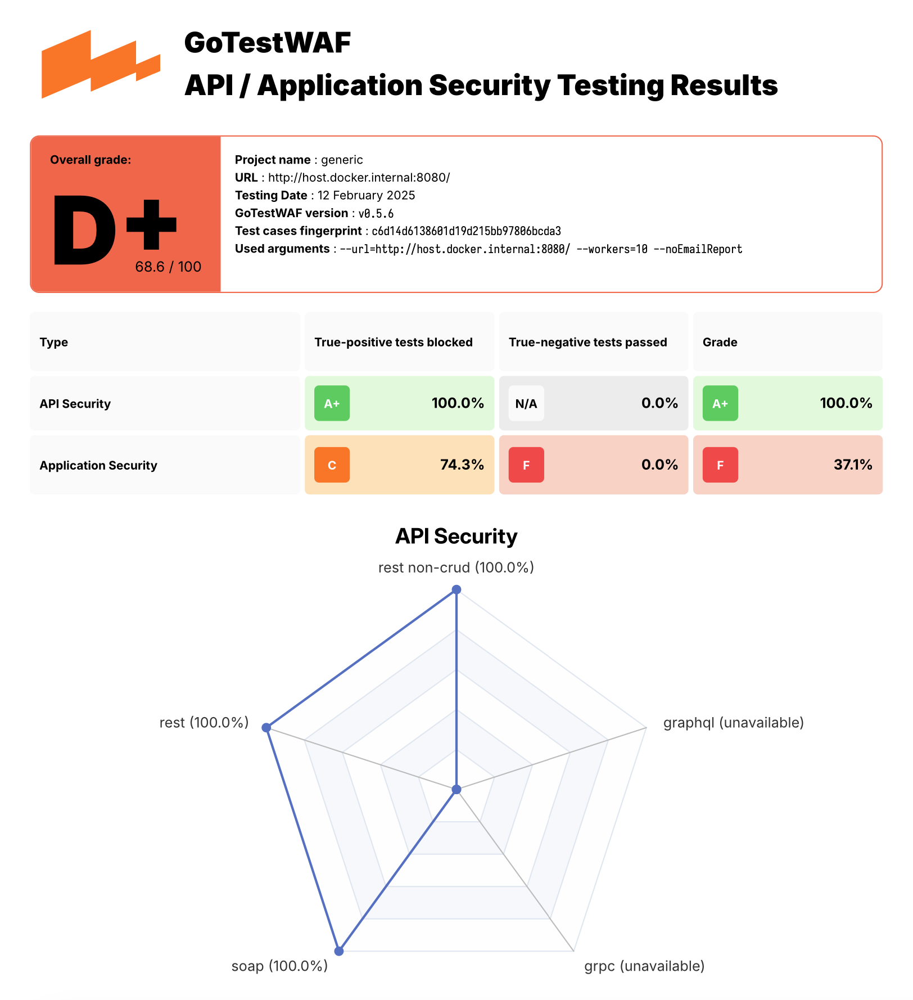

# GoTestWAF [](https://www.blackhat.com/us-22/arsenal/schedule/index.html#gotestwaf---well-known-open-source-waf-tester-now-supports-api-security-hacking-27986)

GoTestWAF is a tool for API and OWASP attack simulation that supports a wide range of API protocols including
REST, GraphQL, gRPC, WebSockets, SOAP, XMLRPC, and others.

It was designed to evaluate web application security solutions, such as API security proxies, Web Application Firewalls,
IPS, API gateways, and others.

---
* [How it works](#how-it-works)
* [Requirements](#requirements)
* [Quick start with Docker](#quick-start-with-docker)
* [Checking evaluation results](#checking-the-evaluation-results)
* [Demos](#demos)
* [Other options to run GoTestWAF](#other-options-to-run-gotestwaf)
* [Configuration options](#configuration-options)
---

## How it works

GoTestWAF generates malicious requests using encoded payloads placed in different parts of HTTP requests: its body, headers,
URL parameters, etc. Generated requests are sent to the application security solution URL specified during GoTestWAF launch.
The results of the security solution evaluation are recorded in the report file created on your machine.

Default conditions for request generation are defined in the `testcases` folder in the YAML files of the following format:

```yaml
---
payload:
  - '"union select -7431.1, name, @aaa from u_base--w-'
  - "'or 123.22=123.22"
  - "' waitfor delay '00:00:10'--"
  - "')) or pg_sleep(5)--"
encoder:
  - Base64Flat
  - URL
placeholder:
  - UrlPath
  - UrlParam
  - JSUnicode
  - Header
type: "SQL Injection"
...
```

* `payload` is a malicious attack sample (e.g XSS payload like ```<script>alert(111)</script>``` or something more sophisticated).
Since the format of the YAML string is required for payloads, they must be [encoded as binary data](https://yaml.org/type/binary.html).

* `encoder` is an encoder to be applied to the payload before placing it to the HTTP request. Possible encoders are:

    * Base64
    * Base64Flat
    * JSUnicode
    * URL
    * Plain (to keep the payload string as-is)
    * XML Entity

* `placeholder` is a place inside HTTP request where encoded payload should be. Possible placeholders are:

    * gRPC
    * Header
    * RequestBody
    * JSONRequest
    * JSONBody
    * HTMLForm
    * HTMLMultipartForm
    * SOAPBody
    * XMLBody
    * URLParam
    * URLPath
    * NonCrudUrlPath
    * NonCrudUrlParam
    * NonCRUDHeader
    * NonCRUDRequestBody

* `type` is a name of entire group of the payloads in file. It can be arbitrary, but should reflect the type of attacks in the file.

Request generation is a three-step process involving the multiplication of payload amount by encoder and placeholder amounts.
Let's say you defined 2 **payloads**, 3 **encoders** (Base64, JSUnicode, and URL) and 1 **placeholder** (URLParameter - HTTP GET parameter).
In this case, GoTestWAF will send 2x3x1 = 6 requests in a test case.

During GoTestWAF launch, you can also choose test cases between two embedded: OWASP Top-10, OWASP-API,
or your own (by using the [configuration option](#configuration-options) `testCasePath`).

## Requirements

* GoTestwaf supports all the popular operating systems (Linux, Windows, macOS), and can be built natively
if [Go](https://golang.org/doc/install) is installed in the system. If you want to run GoTestWaf natively,
make sure you have the Chrome web browser to be able to generate PDF reports. In case you don't have Chrome,
you can create a report in HTML format.
* If running GoTestWAF as the Docker container, please ensure you have [installed and configured Docker](https://docs.docker.com/get-docker/),
and GoTestWAF and evaluated application security solution are connected to the same [Docker network](https://docs.docker.com/network/).
* For GoTestWAF to be successfully started, please ensure the IP address of the machine running GoTestWAF is whitelisted
on the machine running the application security solution.

## Quick start with Docker

The steps below walk through downloading and starting GoTestWAF with minimal configuration on Docker.

1.  Pull the [GoTestWAF image](https://hub.docker.com/r/wallarm/gotestwaf) from Docker Hub:

    ```
    docker pull wallarm/gotestwaf
    ```

2.  Start the GoTestWAF image:

    ```sh
    docker run --network="host" --rm -it -v ${PWD}/reports:/app/reports \
        wallarm/gotestwaf --url=<EVALUATED_SECURITY_SOLUTION_URL>
    ```

    If required, you can replace `${PWD}/reports` with the path to another folder used to place the evaluation report.

    If you don't want to optionally email the report, just press Enter after the email request message appears, or you can use --noEmailReport to skip the message:

    ```sh
    docker run --network="host" --rm -v ${PWD}/reports:/app/reports \
        wallarm/gotestwaf --url=<EVALUATED_SECURITY_SOLUTION_URL> --noEmailReport
    ```

    If the evaluated security tool is available externally, you can skip the option `--network="host"`. This option enables interaction of Docker containers running on 127.0.0.1.

    To perform the gRPC tests you must have a working endpoint and use the --grpcPort <port> cli option.

    ```sh
    docker run --network="host" --rm -it -v ${PWD}/reports:/app/reports \
        wallarm/gotestwaf --grpcPort 9000 --url=http://my.grpc.endpoint
    ```

3.  Check your email for the report.

You have successfully evaluated your application security solution by using GoTestWAF with minimal configuration.
To learn advanced configuration options, please use this [link](#configuration-options).

## Checking the evaluation results

Check the evaluation results logged using the `STDOUT` and `STDERR` services. For example:

```
INFO[0000] GoTestWAF started                             version=v0.3.1-184-gacbbd2d
INFO[0000] Test cases loading started
INFO[0000] Test cases loading finished
INFO[0000] Test cases fingerprint                        fp=ba6e4eb2ac65ba17afa18b04d62af8b9
INFO[0000] Try to identify WAF solution
INFO[0000] WAF was not identified
INFO[0000] WAF pre-check                                 url="http://localhost:8080"
INFO[0000] WAF pre-check                                 blocked=true code=403 status=done
INFO[0000] WebSocket pre-check                           status=started url="ws://localhost:8080"
INFO[0000] WebSocket pre-check                           connection="not available" error="websocket: bad handshake" status=done
INFO[0000] gRPC pre-check                                status=started
INFO[0000] gRPC pre-check                                connection="not available" status=done
INFO[0000] Scanning started                              url="http://localhost:8080"
INFO[0009] Scanning finished                             duration=9.104334843s
Negative Tests:
+-----------------------+-----------------------+-----------------------+-----------------------+-----------------------+-----------------------+-----------------------+-----------------------+
|       TEST SET        |       TEST CASE       |     PERCENTAGE, %     |        BLOCKED        |       BYPASSED        |      UNRESOLVED       |         SENT          |        FAILED         |
+-----------------------+-----------------------+-----------------------+-----------------------+-----------------------+-----------------------+-----------------------+-----------------------+
| community             | community-128kb-rce   |                  0.00 |                     0 |                     0 |                     1 |                     1 |                     0 |
| community             | community-128kb-sqli  |                  0.00 |                     0 |                     0 |                     1 |                     1 |                     0 |
| community             | community-128kb-xss   |                  0.00 |                     0 |                     0 |                     1 |                     1 |                     0 |
| community             | community-16kb-rce    |                100.00 |                     1 |                     0 |                     0 |                     1 |                     0 |
| community             | community-16kb-sqli   |                100.00 |                     1 |                     0 |                     0 |                     1 |                     0 |
| community             | community-16kb-xss    |                100.00 |                     1 |                     0 |                     0 |                     1 |                     0 |
| community             | community-32kb-rce    |                100.00 |                     1 |                     0 |                     0 |                     1 |                     0 |
| community             | community-32kb-sqli   |                100.00 |                     1 |                     0 |                     0 |                     1 |                     0 |
| community             | community-32kb-xss    |                100.00 |                     1 |                     0 |                     0 |                     1 |                     0 |
| community             | community-64kb-rce    |                100.00 |                     1 |                     0 |                     0 |                     1 |                     0 |
| community             | community-64kb-sqli   |                100.00 |                     1 |                     0 |                     0 |                     1 |                     0 |
| community             | community-64kb-xss    |                100.00 |                     1 |                     0 |                     0 |                     1 |                     0 |
| community             | community-8kb-rce     |                100.00 |                     1 |                     0 |                     0 |                     1 |                     0 |
| community             | community-8kb-sqli    |                100.00 |                     1 |                     0 |                     0 |                     1 |                     0 |
| community             | community-8kb-xss     |                100.00 |                     1 |                     0 |                     0 |                     1 |                     0 |
| community             | community-lfi         |                100.00 |                     8 |                     0 |                     0 |                     8 |                     0 |
| community             | community-rce         |                 83.33 |                    10 |                     2 |                     0 |                    12 |                     0 |
| community             | community-sqli        |                100.00 |                    32 |                     0 |                     0 |                    32 |                     0 |
| community             | community-xss         |                 95.80 |                   502 |                    22 |                     0 |                   524 |                     0 |
| community             | community-xxe         |                  0.00 |                     0 |                     2 |                     0 |                     2 |                     0 |
| owasp                 | crlf                  |                 87.50 |                     7 |                     1 |                     0 |                     8 |                     0 |
| owasp                 | ldap-injection        |                 12.50 |                     2 |                    14 |                     0 |                    16 |                     0 |
| owasp                 | mail-injection        |                 12.50 |                     3 |                    21 |                     0 |                    24 |                     0 |
| owasp                 | nosql-injection       |                  0.00 |                     0 |                    30 |                     0 |                    30 |                     0 |
| owasp                 | path-traversal        |                 25.45 |                    28 |                    82 |                     0 |                   110 |                     0 |
| owasp                 | rce                   |                 22.22 |                     4 |                    14 |                     0 |                    18 |                     0 |
| owasp                 | rce-urlparam          |                 33.33 |                     3 |                     6 |                     0 |                     9 |                     0 |
| owasp                 | shell-injection       |                 27.08 |                    13 |                    35 |                     0 |                    48 |                     0 |
| owasp                 | sql-injection         |                 33.33 |                    24 |                    48 |                     0 |                    72 |                     0 |
| owasp                 | ss-include            |                 37.50 |                    15 |                    25 |                     0 |                    40 |                     0 |
| owasp                 | sst-injection         |                 18.75 |                    12 |                    52 |                     0 |                    64 |                     0 |
| owasp                 | xml-injection         |                  0.00 |                     0 |                    12 |                     1 |                    13 |                     0 |
| owasp                 | xss-scripting         |                 34.56 |                    47 |                    89 |                     0 |                   136 |                     0 |
| owasp-api             | graphql               |                  0.00 |                     0 |                     6 |                     0 |                     6 |                     0 |
| owasp-api             | graphql-post          |                 50.00 |                     2 |                     2 |                     0 |                     4 |                     0 |
| owasp-api             | grpc                  |                  0.00 |                     0 |                     0 |                     0 |                     0 |                     0 |
| owasp-api             | non-crud              |                100.00 |                     2 |                     0 |                     0 |                     2 |                     0 |
| owasp-api             | rest                  |                100.00 |                     2 |                     0 |                     0 |                     2 |                     0 |
| owasp-api             | soap                  |                100.00 |                     2 |                     0 |                     0 |                     2 |                     0 |
+-----------------------+-----------------------+-----------------------+-----------------------+-----------------------+-----------------------+-----------------------+-----------------------+
|         DATE:         |     PROJECT NAME:     | TRUE NEGATIVE SCORE:  |  BLOCKED (RESOLVED):  | BYPASSED (RESOLVED):  |  UNRESOLVED (SENT):   |      TOTAL SENT:      |    FAILED (TOTAL):    |
|      2022-10-04       |        GENERIC        |        61.19%         |   730/1193 (61.19%)   |   463/1193 (38.81%)   |    4/1197 (0.33%)     |         1197          |    0/1197 (0.00%)     |
+-----------------------+-----------------------+-----------------------+-----------------------+-----------------------+-----------------------+-----------------------+-----------------------+

Positive Tests:
+-----------------------+-----------------------+-----------------------+-----------------------+-----------------------+-----------------------+-----------------------+-----------------------+
|       TEST SET        |       TEST CASE       |     PERCENTAGE, %     |        BLOCKED        |       BYPASSED        |      UNRESOLVED       |         SENT          |        FAILED         |
+-----------------------+-----------------------+-----------------------+-----------------------+-----------------------+-----------------------+-----------------------+-----------------------+
| false-pos             | texts                 |                 85.65 |                    31 |                   185 |                     0 |                   216 |                     0 |
+-----------------------+-----------------------+-----------------------+-----------------------+-----------------------+-----------------------+-----------------------+-----------------------+
|         DATE:         |     PROJECT NAME:     | FALSE POSITIVE SCORE: |  BLOCKED (RESOLVED):  | BYPASSED (RESOLVED):  |  UNRESOLVED (SENT):   |      TOTAL SENT:      |    FAILED (TOTAL):    |
|      2022-10-04       |        GENERIC        |        85.65%         |    31/216 (14.35%)    |   185/216 (85.65%)    |     0/216 (0.00%)     |          216          |     0/216 (0.00%)     |
+-----------------------+-----------------------+-----------------------+-----------------------+-----------------------+-----------------------+-----------------------+-----------------------+

Summary:
+-----------------------------+-----------------------------+-----------------------------+-----------------------------+
|            TYPE             | TRUE-NEGATIVE TESTS BLOCKED | TRUE-POSITIVE TESTS PASSED  |           AVERAGE           |
+-----------------------------+-----------------------------+-----------------------------+-----------------------------+
| API Security                | 50.00%                      | n/a                         | 50.00%                      |
| Application Security        | 61.34%                      | 85.65%                      | 73.50%                      |
+-----------------------------+-----------------------------+-----------------------------+-----------------------------+
|                                                                        SCORE            |           61.75%            |
+-----------------------------+-----------------------------+-----------------------------+-----------------------------+

INFO[0015] Export full report                            filename=reports/waf-evaluation-report-2022-October-04-15-10-33.pdf
```

The report file `waf-evaluation-report-<date>.pdf` is available in the `reports` folder of the user directory. You can also specify the directory to save the reports with the `reportPath` parameter and the name of the report file with the `reportName` parameter. To learn advanced configuration options, please use this [link](#configuration-options).



## Demos

You can try GoTestWAF by running the demo environment that deploys NGINX‑based [ModSecurity using OWASP Core Rule Set](https://hub.docker.com/r/owasp/modsecurity-crs)
and GoTestWAF evaluating ModSecurity on Docker.

To run the demo environment:

1.  Clone this repository and go to the cloned directory:

    ```sh
    git clone https://github.com/wallarm/gotestwaf.git
    cd gotestwaf
    ```

2.  Start ModSecurity from the [Docker image](https://hub.docker.com/r/owasp/modsecurity-crs/) by using the following `make` command:

    ```sh
    make modsec
    ```

    Settings for running the ModSecurity Docker container are defined in the rule `modsec` of the cloned Makefile. It runs the ModSecurity Docker container on port 8080 with minimal configuration defined in the cloned file `./resources/default.conf.template` and the `PARANOIA` value set to 1.

    If required, you can change these settings by editing the rule `modsec` in the cloned Makefile. Available options for ModSecurity configuration are described on [Docker Hub](https://hub.docker.com/r/owasp/modsecurity-crs/).

    To stop ModSecurity containers use the following command:

    ```sh
    make modsec_down
    ```

3.  Start GoTestWAF with minimal configuration by using one of the following methods:

    Start the [Docker image](https://hub.docker.com/r/wallarm/gotestwaf) by using the following `docker pull` and `docker run` commands:

    ```sh
    docker pull wallarm/gotestwaf
    docker run --network="host" --rm -v ${PWD}/reports:/app/reports \
        wallarm/gotestwaf --url=http://127.0.0.1:8080 --noEmailReport
    ```

    Build the GoTestWAF Docker image from the [Dockerfile](./Dockerfile) and run the
    image by using the following `make` commands (make sure ModSec is running on port 8080; if not, update the port value in the Makefile):

    ```sh
    make gotestwaf
    make scan_local_from_docker
    ```

    Start GoTestWAF natively with go by using the following `make` command:
    (make sure ModSec is running on port 8080; if not, update the port value in the Makefile):

    ```sh
    make scan_local
    ```

4.  Find the [report](#checking-the-evaluation-results) file `waf-evaluation-report-<date>.pdf` in
the `reports` folder that you mapped to `/app/reports` inside the container.

## Other options to run GoTestWAF

In addition to running the GoTestWAF Docker image downloaded from Docker Hub, you can run GoTestWAF by using the following options:

*   Clone this repository and build the GoTestWAF Docker image from the [Dockerfile](./Dockerfile), for example:

    ```sh
    git clone https://github.com/wallarm/gotestwaf.git
    cd gotestwaf
    DOCKER_BUILDKIT=1 docker build --force-rm -t gotestwaf .
    docker run --network="host" --rm -it -v ${PWD}/reports:/app/reports \
        gotestwaf --url=<EVALUATED_SECURITY_SOLUTION_URL>
    ```

    If the evaluated security tool is available externally, you can skip the option `--network="host"`. This option enables interaction of Docker containers running on 127.0.0.1.

* Clone this repository and run GoTestWAF with [`go`](https://golang.org/doc/), for example:

    ```sh
    git clone https://github.com/wallarm/gotestwaf.git
    cd gotestwaf
    go run ./cmd --url=<EVALUATED_SECURITY_SOLUTION_URL>
    ```

*   Clone this repository and build GoTestWAF as the Go module:

    ```sh
    git clone https://github.com/wallarm/gotestwaf.git
    cd gotestwaf
    go build -mod vendor -o gotestwaf ./cmd
    ```

Supported GoTestWAF configuration options are described below.

## Configuration options

```
Usage: ./gotestwaf [OPTIONS] --url <URL>

Options:
      --addDebugHeader          Add header with a hash of the test information in each request
      --addHeader string        An HTTP header to add to requests
      --blockConnReset          If true, connection resets will be considered as block
      --blockRegex string       Regex to detect a blocking page with the same HTTP response status code as a not blocked request
      --blockStatusCodes ints   HTTP status code that WAF uses while blocking requests (default [403])
      --configPath string       Path to the config file (default "config.yaml")
      --email string            E-mail to which the report will be sent
      --followCookies           If true, use cookies sent by the server. May work only with --maxIdleConns=1
      --grpcPort uint16         gRPC port to check
      --idleConnTimeout int     The maximum amount of time a keep-alive connection will live (default 2)
      --ignoreUnresolved        If true, unresolved test cases will be considered as bypassed (affect score and results)
      --logFormat string        Set logging format: text, json (default "text")
      --logLevel string         Logging level: panic, fatal, error, warn, info, debug, trace (default "info")
      --maxIdleConns int        The maximum number of keep-alive connections (default 2)
      --maxRedirects int        The maximum number of handling redirects (default 50)
      --noEmailReport           Save report locally
      --nonBlockedAsPassed      If true, count requests that weren't blocked as passed. If false, requests that don't satisfy to PassStatusCodes/PassRegExp as blocked
      --openapiFile string      Path to openAPI file
      --passRegex string        Regex to a detect normal (not blocked) web page with the same HTTP status code as a blocked request
      --passStatusCodes ints    HTTP response status code that WAF uses while passing requests (default [200,404])
      --proxy string            Proxy URL to use
      --quiet                   If true, disable verbose logging
      --randomDelay int         Random delay in ms in addition to the delay between requests (default 400)
      --renewSession            Renew cookies before each test. Should be used with --followCookies flag
      --reportFormat string     Export report to one of the following formats: none, pdf, html, json (default "html")
      --reportName string       Report file name. Supports `time' package template format (default "waf-evaluation-report-2006-January-02-15-04-05")
      --reportPath string       A directory to store reports (default "reports")
      --sendDelay int           Delay in ms between requests (default 1000)
      --skipWAFBlockCheck       If true, WAF detection tests will be skipped
      --skipWAFIdentification   Skip WAF identification
      --testCase string         If set then only this test case will be run
      --testCasesPath string    Path to a folder with test cases (default "testcases")
      --testSet string          If set then only this test set's cases will be run
      --tlsVerify               If true, the received TLS certificate will be verified
      --url string              URL to check
      --version                 Show GoTestWAF version and exit
      --wafName string          Name of the WAF product (default "generic")
      --workers int             The number of workers to scan (default 5)
      --wsURL string            WebSocket URL to check
```

The listed options can be passed to GoTestWAF as follows:

* If running the GoTestWAF Docker container, pass the configuration options in the `docker run` command after the Docker image name.

    For example, to run GoTestWAF with WebSocket check, you can specify the WebSocket URL via the `wsURL` option:

    ```sh
    docker run --network="host" --rm -it -v ${PWD}/reports:/app/reports \
        wallarm/gotestwaf --url=http://127.0.0.1:8080/ --wsURL=ws://127.0.0.1:8080/api/ws
    ```

* If running GoTestWAF with `go run`, pass the configuration options and its values as the parameters for the main script.

    For example, to run GoTestWAF with WebSocket check, you can specify the WebSocket URL via the `wsURL` option:

    ```sh
    go run ./cmd --url=http://127.0.0.1:8080/ --wsURL=ws://127.0.0.1:8080/api/ws
    ```

### Report name

With the `reportName` option you can set your own filename for GoTestWAF reports. This option supports golang's `time` package for timestamps. Details can be found [there](https://pkg.go.dev/time#pkg-constants). You can use following placeholders to add timestamp to your report name:

* Year: `2006`, `06`
* Month: `Jan`, `January`
* Textual day of the week: `Mon`, `Monday`
* Numeric day of the month: `2`, `_2`, `02`
* Numeric day of the year: `__2`, `002`
* Hour: `15`, `3`, `03` (PM or AM)
* Minute: `4`, `04`
* Second: `5`, `05`
* AM/PM mark: `PM`
* Numeric zones: `Z0700` = Z or ±hhmm, `Z07:00` = Z or ±hh:mm, `Z07` = Z or ±hh

For example, default `reportName` is `waf-evaluation-report-2006-January-02-15-04-05`, where `2006` will be replaced with actual year, `January` - month, `02` - day, `15` - hour, `04` - minute and `05` - second.


### Scan based on OpenAPI file

For better scanning, GTW supports sending malicious vectors through valid application requests. Instead of constructing requests that are simple in structure and send them to the URL specified at startup, GoTestWAF creates valid requests based on the application's API description in the OpenAPI 3.0 format.

How it works:

1. GoTestWAF loads an OpenAPI file and constructs request templates. All templates are then divided into groups based on what placeholders they support (e.g., if there is a string parameter in the request path, then such a request will be assigned to a group of requests that support URLPath placeholder)

2. The next malicious vector is selected from the queue for sending. Based on the placeholder specified for it, all query templates are selected into which this vector can be substituted. Next, the vector is substituted into template and the request is sent.

3. Based on the possible responses specified in the OpenAPI file, it is determined whether the request was blocked by WAF or passed to the application. If the status of the response code and its scheme match those described in the OpenAPI file, the request is marked as bypassed. Otherwise, it will be marked as blocked. It is possible that the application only responds with a status code, and this status code matches the response from the WAF. In this case, the request will be marked as unresolved.

Some supported OpenAPI features:

* numeric and string parameters in headers, paths, query parameters and body of requests;

* the following content-types are supported for the request body: `application/json`, `application/xml`, `application/x-www-form-urlencoded`, `text/plain`;

* the following modifiers are supported for XML: `name`, `wrapped`, `attribute`, `prefix`, `namespace`;

* length limits for strings are supported through the `minLength` and `maxLength` parameters;

* value restrictions for numbers are supported through `minimum`, `maximum`, `exclusiveMinimum` and `exclusiveMaximum`;

* restrictions on the length of arrays through `minItems` and `maxItems` are supported;

* combination of schemes via `oneOf`, `anyOf`, `allOf` is supported.

Based on the described principle of operation, it is extremely important that the OpenAPI file correctly represents the implemented application API. Therefore, for example, you cannot use `default` to describe possible responses to queries.

Example:

```sh
./gotestwaf --url https://example.com/v1 --openapiFile api.yaml
```
